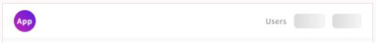
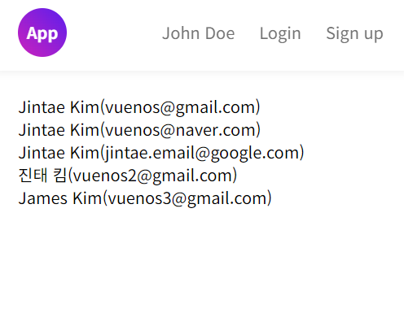
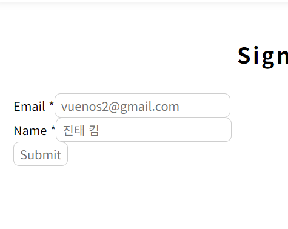
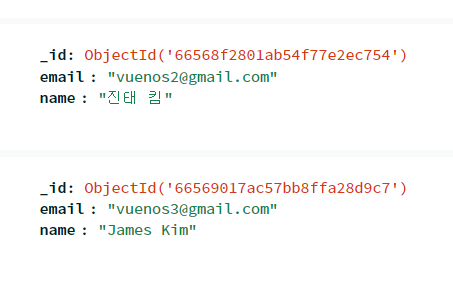
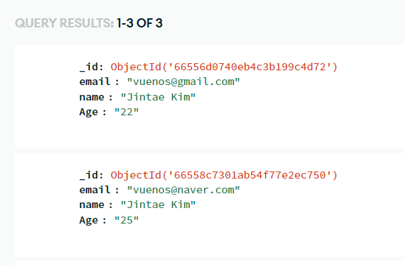
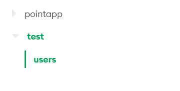
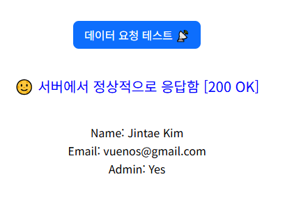
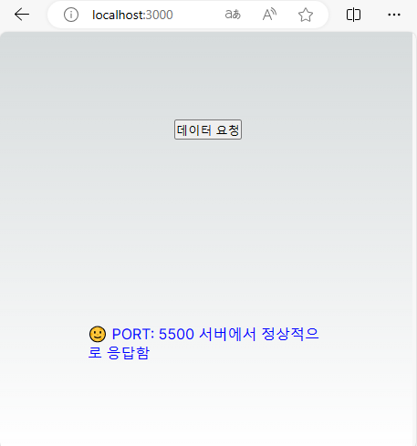
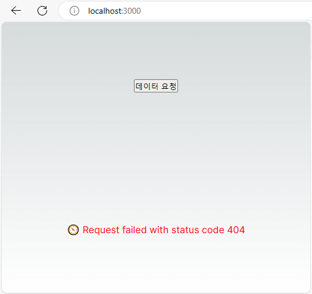

This is a [Next.js](https://nextjs.org/) project bootstrapped with [`create-next-app`](https://github.com/vercel/next.js/tree/canary/packages/create-next-app).

# Point App


## 🖥 Interface
### Front
- 회원가입, 로그인
- Point 카드 등록, 조회
- Point 적립, 사용 내역 확인, 조회 
- Point 사용가능처 조회 (Map)


### Backend
- 회원 관리(등록, 삭제, 기본정보, 포인트 내역)
- Point 카드 관리(등록, 삭제)
- 사용가능처 등록(Map)


## ⏳ History

### 📆 June, 2024
#### Session 정보 display 이슈
- Nextauth (현재 4.x) 가 5.x 버전으로 업데이트 되면서 서비스 명칭이 [Auth.js](https://authjs.dev/) 으로 바뀌었다. 아직까지는 5버전으로 마이그레이션 하지 않음 상태.
- 인증을 하고 session 이 풀리는 현상이 있음. (새로고침 등)
- session 딜레이: 인증 session 취득 후 next/link 를 통한 인터널 페이지 이동에서는 보이지 않으나 새로고침을 했을 경우 session 취득 이전의 UI (Sign In, Log In 버튼 등)이 약 1~2초 정도 보인 후 session 이 적용된 UI (유저네임, Log Out)가 보이는 현상이 있음.
- SSR 이슈인가? Nextauth의 버그인가? 5.x 로 업데이트 하면 해결되는 것인지? 현재로써는 좀 더 확인해 봐야 할 문제같다.
- Auth.js 에서 session prefetch 기능이 있다. Roor 컴포넌트 Provider 에서 session 이란 props 를 통해 route 이동시에 미리 session 정보를 가지고 있는가는 개념같은데, SessionProvider 에서 이 부분이 이미 적용되어 있는거 아니었나? 이 부분은 좀 더 확인필요함.
- 일단은 Session status 의 Loading 상태로 중간에 생기는 딜레이 중에 해당 UI 부분에 스켈레톤 UI를 적용해서 로딩 UI를 표현함.
```javascript
// Session status 'Loading' 일 때 보여 줄 UI 객체
const loadingAnimation = keyframes`
  0% {
    background-position: -200% 0;
  }
  100% {
    background-position: 200% 0;
  }
`;

const SkeletonSpan = styled.span<{ width: string, height: string, margin: string }>`
    display: block;
    background: linear-gradient(90deg, #DADADA, #f5f5f5, #DADADA);
    background-size: 200% 100%;
    animation: ${loadingAnimation} 1.5s infinite;
    width: ${props => props.width};
    height: ${props => props.height};
    margin: ${props => props.margin};
    border-radius: 8px;
`;

// Header.tsx 
const showSession = () => {
    if (status === "authenticated") {
      return (
        <>
          ...
        </>
      )
    } else if (status === "loading") {
      return (
        <>
          <SkeletonSpan width="68px" height="32px" margin="0 0 0 16px"/>
          <SkeletonSpan width="64px" height="32px" margin="0 0 0 16px"/>
        </>
      )
    } else {
      return (
        <>
          ...
        </>
      )
    }
  }
```
   
   

### 📆 June 5, 2024
#### NextAuth.js 구현과 오류 해결
- 사용자인증을 [NextAuth.js](https://next-auth.js.org/getting-started/introduction) 로 적용하기로 함.
- 공식사이트에서는 Next.js 을 위한 완전한 오픈 소스로 소개하고 있다.
- 인증을 구현하는 resource 들이 잘정리되어 있다. [Get Started](https://next-auth.js.org/getting-started/example)

### 시작하며
- NextAuth.js 는 ```/api/auth``` path 안에서 인증을 처리한다.
- /app/api/auth/[...nextauth]/route.ts 라우트를 만들어 GET, POST method 를 매핑하는 handler 를 만들어 준다. (Next.js 14 기준)
- [...] 은 동적 라우팅을 의미함. signIn, signOut, callback 등의 요청이 여기를 통해 처리된다. auth.ts 를 연결해서 인증부분까지
> All requests to /api/auth/*(signIn, callback, signOut, etc.) will automatically be handled by NextAuth.js.
  
- /api/auth/* 로 들어오는 api 요청은 /api/auth/[...nextauth]/route.ts 에서 자동으로 처리해 준다는 것이다.

```javascript
// app/api/auth/[...nextauth]/route.ts
import { authOptions } from "@/libs/auth";
import NextAuth from "next-auth";

const handler = NextAuth(authOptions);

export {
    handler as GET, handler as POST
}
```
- 인증을 처리하는 auth.ts 를 작성한다. 나는 ```/app/lib/auth.ts``` 로 작성


```javascript
// /app/lib/auth.ts

export const authOptions: NextAuthOptions = {
    providers: [
        GoogleProvider({
            clientId: process.env.GOOGLE_CLIENT_ID as string,
            clientSecret: process.env.GOOGLE_CLIENT_SECRET as string,
        }),
        CredentialsProvider({
            name: "Credentials",
            id: "credentials",
            credentials: {
                email: { label: "Email", type: "text", placeholder: "Email" },
                password: { label: "Password", type: "password" },
            },
            async authorize(credentials, req): Promise<any> {
                await connectDB();
                const userFound = await User.findOne({
                    email: credentials?.email,
                }).select("+password");

                if (!userFound) throw new Error("Invalid Email");

                const passwordMatch = await bcrypt.compare(
                    credentials!.password,
                    userFound.password,
            );

                if (!passwordMatch) throw new Error("Invalid Password");
                return userFound;
            },
        }),
    ],
// 생략
```
- 기본적으로 email 과 비밀번호 인증을 제공한다. 구글 OAuth 도 제공한다.
- provider 로 구글, 깃허브 같은 OAuth 인증, 기본적인 credentials 와 같은 자격증명인증(email 또는 ID 와 비밀번호)을 제공한다. 
- ```CredentiaslProvider``` 에서는 ```credentials``` 프로퍼티를 통해 인증을 위해 어떤 정보를 입력받을지 지정할 수 있다. (email or user id)
- 위에서 입력받은 프로퍼티 값을 가진 객체가 authorize 콜백 함수에 첫번째 인수로 전달됨(HTTP POST) 그러면 사용자객체(email, name, _id 등), 또는 null, Error 중 하나를 반환하는 것이다.
- 

### 📆 June 4, 2024
#### 사용자 등록 로직
- 사용자 등록을 위한 로직을 구현한다. 프론트에서 입력받은 데이터를 백엔드로 보내고 백엔드에서는 해당 데이터의 모델을 통해 검증한 후 db에 접속 -> 저장하게 된다.  

#### Backend
- TODO: 사용자 이메일 중복체크, 데이터 모델 정의가 필요하다. 
- bcrypt로 password를 암호화 했다.

```javascript
export async function POST(request: NextRequest) {
    try {
        const client = await connect;
        const body = await request.json();
        
        const salt = await bcrypt.genSalt(10);
        const hashedPassword = await bcrypt.hash(body.password, salt);

        await client.db("test").collection("users").insertOne({
            name: body.name,
            email: body.email,
            password: hashedPassword
        });
        
        return NextResponse.json({
            message: "successfully updated the document",
            success: true,
        })
    } catch (error: any) {
        return NextResponse.json({ error: error.message }, { status: 500 })
    }
}
```
  
#### Frontend
- onSubmit 이벤트로 폼을 전송하고, ```event.preventDefault()``` 로 폼이 무작정 전송되는걸 막는다.
- 입력값 validator 필요함.
- 인증 로직이 완성되면 인증여부에 따른 접근 여부 작업도 필요(Router).

```javascript
const [email, setEmail] = useState<string>("");
const [name, setName] = useState<string>("");
const [password, setPassword] = useState<string>("");

const userInput = {
    email,
    name,
    password,
}

const submitHandler = async (event) => {
    event.preventDefault();
    try {
        const { data, status } = await axios.post("/api/users/regist", userInput, {
            headers: {
                'Content-Type': 'application/json'
            }
        });

        if (status === 200) {
            router.push("/member/login")
        }
    } catch (error) {
        console.log(error.message)
    }
}

<form onSubmit={submitHandler}>
    <InputGroup 
        inputId="email"
        type="email"
        label="이메일"
        title="Email"
        required={true}
        value={email}
        placeholder="Email"
        className="input-text"
        onchange={(e) => setEmail(e.target.value)}
    />
    .
    .
    .
    <Input
        type="submit"
        value="Submit"
        className="input-button submit"
    />
</form>
```

일단 등록은 정상적으로 된다. 


### 📆 May 31, 2024

#### 인증 로직 구현
- bcrypt, jsonwebtoken 패키지로 유저등록시 보내는 데이터를 암호화하고 웹토큰을 만들어서 유저의 데이터를 검증하고 인증할 것 이다.

### 📆 May 30, 2024
#### UI loading
Nextjs App Router 에서는 약속된 파일 중(layout, page, route 등등) 하나인 loading.ts 라는 파일이 있다. 이는 페이지간 이동 시 렌더링이 되는 동안 대체되는 ui 를 보여줄 수 있다.  
컴포넌트별로도 적용할 수 있다.  
layout.tsx와 page.tsx 와 같은 경로에 만들어 두면 해당 layout.tsx 로 랩핑되어 있는 화면 및 컴포넌트는 모두 자동 적용된다.  
  
```Suspense``` 를 통해 컴포넌트 별로 로딩 UI를 수동 설정할 수 있다.  

  
  
- loading.tsx 파일을 최상단의 page.tsx 와 같은 경로에 두어 공통 로딩 UI로 적용함. 페이지간 이동시에 적용되는 것이 확인됨. (프로젝트 초기 단계라 페이지 렌더링이 빨라서 인지 거의 보이지 않음)
- ```<Suspense><Component /></Suspense>``` 사용해 보았으나 적용이 안되는거 같음... 이유는 확실히 모르겠다. react developer tools 로 마운트 된 components 를 보면 ```<Suspense>```가 존재함. 
- loading.tsc 를 사용해서 데이터 패치 상태에 따른 로직을 구현.
```TypeScript
// loading 상태 추가
const [loading, setLoading] = useState<boolean>(true);

const getUsersHandler = async () => {
    try {
        const res = await axios.get("/api/users/");
        
        if (res.status === 200) {
            setUsers(res.data);
            setLoading(false); // data 가 성공적으로 패치되면 로딩 감춤
        }
    } catch(error) {
        setError(true);            
        setLoading(false);
        setErrMsg(
            error.reponse && error.response.data.message
            ? error.response.data.message
            : error.message
        );
        console.log(error.message);
    }
    
}

 if (loading) return <Loading />;

 return (
    <>
        ... 
    </>
 )

```


### 📆 May 29, 2024

저장된 유저들 정보 가져오기  
users collection 에 저장된 저들의 데이터(document)를 front 화면에서 호출하기  
- app/api/users/route.ts 에 유저데이터를 호출하는 콘트롤러를 만들어 /api/users API endpoint 생성
```javascript
// app/api/users/route.ts
// /api/users
export async function GET(req: NextRequest) {
    const client = await connect;
    const usersData = await client.db("test").collection("users").find();
    const getUsers = await usersData.toArray();

    return NextResponse.json(getUsers);
}

// app/member/users/page.tsx
// /member/users
const [users, setUsers] = useState([]);

const getUsersHandler = async () => {
    try {
        const { data, status } = await axios.get("/api/users/");
        if (status === 200) {
            setUsers(data);
        }
    } catch(error) {
        console.log(error.message);
    }
    
}

useEffect(() => {
    getUsersHandler();
}, []);

return (
    <>
        <ul>
            {users && users.map((user) => (
                <li key={user._id}>
                    {user.name}({user.email})
                </li>
            ))}
        </ul>
    </>
)
```
[프론트 화면]  



### 📆 May 29, 2024

DB 저장 이벤트 핸들러 추가  
Backend 에서 유저데이터 email, name 을 users collection 에 저장할 수 있는 이벤트 핸들러를 추가한다.  
Front 화면에는 email, name 데이터를 보낼 수 있는 form 을 만든다. (신규유저 등록을 위해서는 password 도 필요하다. password 는 암호화 로직도 필요) 
Front 에서는 유저데이터를 /api/users/regist api 를 호출하여 db에 저장하게 된다.
```javascript
// app/api/users/regist/route.ts
export async function POST(request: Request) {
    const client = await connect;
    const body = await request.json();
    await client.db("test").collection("users").insertOne({
        email: body.userEmail,
        name: body.userName,
    });
    return Response.json({
        message: "successfully updated the document"
    })
}

// app/member/join/page.tsx
const submitHandler = () => {
    fetch("/api/users/regist", {
        method: "POST",
        body: JSON.stringify({
            userEmail, 
            userName, 
            userPassword
        })
    })
}

// <InputGroup> 은 input 과 label 등으로 구성된 컴포넌트 
<form onSubmit={submitHandler}>
    <InputGroup 
        inputId="userEmail"
        type="email"
        title="Email"
        required={true}
        value={userEmail}
        placeholder="Email"
        onchange={(e) => setUserEmail(e.target.value)}
    />
    <InputGroup 
        inputId="userName"
        type="text"
        title="Name"
        required={true}
        value={userName}
        placeholder="Name"
        onchange={(e) => setUserName(e.target.value)}
    />

    <Input
        type="submit"
        value="Submit"
    />
</form>
```
[입력화면]  


[Form 전송결과]  



### 📆 May 28, 2024

MongDB에 연결하고 데이터를 POST, GET 하는 테스트 코드.  
- API route 의 기본코드
```javascript
const { MongoClient, ServerApiVersion } = require("mongodb");

// Replace the placeholder with your Atlas connection string
const uri = "<connection string>";

// Create a MongoClient with a MongoClientOptions object to set the Stable API version
const client = new MongoClient(uri,  {
        serverApi: {
            version: ServerApiVersion.v1,
            strict: true,
            deprecationErrors: true,
        }
    }
);

async function run() {
  try {
    // Connect the client to the server (optional starting in v4.7)
    await client.connect();

    // Send a ping to confirm a successful connection
    await client.db("admin").command({ ping: 1 });
    console.log("Pinged your deployment. You successfully connected to MongoDB!");
  } finally {
    // Ensures that the client will close when you finish/error
    await client.close();
  }
}
run().catch(console.dir);

```
  
db에 접속한 후 데이터를 보내는 테스트 페이지를 추가.  
```javascript
// api/users/regist/route.ts
// /api/users/regist entpoint가 생성됨

export async function POST(request: Request){
    const client = await connect;
    const cursor = await client.db("test").collection("users").insertOne({
        email:"vuenos@gmail.com",
        name: "Jintae Kim",
        Age: "22"
    });
    return Response.json({message: "successfully updated the document"})
}

// app/test/page.tsx
export default function TestApi() {
    useEffect(() => {
        fetch("/api/users/regist", {
            method: "POST"
        })
    }, []);

    return (
        <h1>Some Content</h1>
    )
}
```

이러면 http://localhost:3000/test 접속시  
MongoDB 의 'test' db 의 'users' collection 에 email, name, age 데이터를 저장함.

- ```insertOne``` : 단일 document 를 collection 에 저장
- ```insertMany``` : 다중 document 를 collection 에 저장  

[참고] https://www.mongodb.com/ko-kr/docs/manual/reference/method/db.collection.insertOne/


[결과]


[참고]  
- https://www.mongodb.com/ko-kr/docs/atlas/device-sdks/web/nextjs/
- https://www.mongodb.com/docs/drivers/node/current/fundamentals/connection/connect/#std-label-node-connect-to-mongodb
- https://ellertsmarik.medium.com/json-api-using-next-js-13-and-mongodb-f45e8e61b031

### 📆 May 22, 2024
#### MongoDB 세팅
DB는 몽고디비를 사용하기로 했다.  
등록, 조회 의 기능이 대부분이라 무리 없어 보였다.  
db,collection을 생성
 


### 📆 May 20, 2024
Express 로 백엔드를 구성.했을때  
프론트와 별개로 서버호스팅을 구성해야 한다  
vercel 로 deploy 하여 production 상태로 만들어서 온라인으로 접속해 보면 프론트는 정상적으로 보이지만  
API 를 호출했을때 통신이 되지 않는다. 백엔드 리소스를 별도로 호스팅 하여 호출해야 하는 것이다.  
- Next.js 로 개발하는데 Express 로 백엔드를 별도로 구성하기 보다 Next.js 의 [Route Handlers](https://nextjs.org/docs/app/building-your-application/routing/route-handlers) 로 endpoint 를 만들면 되겠다는 생각이 들었다.
- route 구성은 프론트와 동일하다. /app/api/users/route.ts 는 /api/users 라는 endpoint 를 만들어 준다.
- /app/api/users/route.ts 에 호출시 반환되는 이벤트 핸들러를 작성해 주면 된다.
- GET, POST 라는 함수명이 그대로 그 역활을 수행해 준다.  

```javascript
// /app/api/users/route.ts
import {NextRequest, NextResponse} from "next/server";

export async function GET(req: NextRequest) {
    return NextResponse.json({
        name: "Jintae Kim",
        email: "vuenos@gmail.com",
        isAdmin: true,
    })
}

// /app/page.tsx
const callDataHandler = async () => {
    try {
      const { data, status } = await axios.get(`${url}/test`);

      if (status === 200) {
        setUserData(data);
        setCallStatus("suceess");
        setMsg(`서버에서 정상적으로 응답함`);
      }
    } catch(error: any) {
      console.log(error.message)
      setCallStatus("failed");
      setMsg(`서버 통신 실패`);
    };
  };
```
    

프론트에서의 결과는 아래와 같다.  
    


***

### 📆 May 18, 2024
헤더의 공통 네비게이션에서 현재 메뉴의 활성화 스타일 적용  
React 에서는 NavLink 를 이용하면 쉽게 적용이 되지만 Next.js 에서는 지원하지 않는다.  
그래서 커스텀을 해야 한다.
- 1차 방법 : next/router 의 useRouter 를 이용해서 현재페이지의 pathname 을 특정해서 비교하는 방법
- 먼저 메뉴의 정보에 대한 객체 배열을 만들어 주고, 
```javascript
const menuData = [
    { id: "menu01", title: `${userName}`, path: "/member/mypage" },
    { id: "menu02", title: "Login", path: "/member/login" },
    { id: "menu03", title: "Sign up", path: "/member/join" },
];
```
- path 값과 현재 pathname 을 비교하여 특정 스타일을 적용한다.
```javascript
const router = useRouter();

{menuData.map((menuItem) => (
    <Link
        href={menuItem.path}
        className={`${menuItem.path === router.pathname ? "active" : ""}`}
    >
        {menuItem.title}
    </Link>
))}
```
그런데 다음과 같은 에러가 뜬다.  
<span style="color: red">Error: NextRouter was not mounted.</span>  
Next.js 13 부터는 next/router 대신 next/navigation 를 사용해야 한다.
```javascript
// refactor
import { usePathname } from "next/navigation";

const pathname = usePathname();

{menuData.map((menuItem) => (
    <Link
        href={menuItem.path}
        className={`${menuItem.path === pathname ? "active" : ""}`}
    >
        {menuItem.title}
    </Link>
))}
```  
참고 : https://nextjs.org/docs/app/api-reference/functions/use-router  

***  

 
### 📆 May 16, 2024
#### Next.js App Router
Next.js 13 부터 app/ 디렉토리를 기반으로 라우팅이 구성된다.  
app/about 이란 dir 를 만들고 page.tsx 를 생성하면 /about 이란 route 가 구성이 되는 것이다.  
Layout.tsx 로 레이아웃을 구성할 수 있다. /app/page.tsx 가 "/" 이란 route 가 된다.  
Layout 은 여러 경로 간에 공유되는 UI 이다. Route 간의 이동 시 레이아웃 상태를 유지하고 상호교환 상태를 유지하며 리렌더링 되지 않는다.  

```javascript
// app/layout.js
export default function RootLayout({
   children,
}: Readonly<{
    children: React.ReactNode;
}>) {
    return (
        <html lang="ko">
            <body>
                <Header />
                <Wrapper>{children}</Wrapper>
                <Footer />
            </body>
        </html>
    );
}

// app/page.js
export default function Page() {
  return <h1>Hello, World</h1>;
}
```
- /app/member/login/page.tsx : /member/login
- 참고 : https://nextjs.org/docs/app/building-your-application/routing/layouts-and-templates

***  

### 📆 May 13, 2024
- User 데이터 모델 생성
- /server/ 내에 routes, models, controller 를 생성한다.
- routes/userRoutes.js 에 백엔드에서 요청받을 routes 를 정의한다.
```javascript
const router = express.Router();

router.route("/")
    .post(registerUser)
    .get(protect, admin)

router
    .post("/login", authUser)

router
    .route('/profile')
    .get(protect, getUserProfile)
    .put(protect, updateUserProfile)

router
    .route('/:id')
    .delete(protect, admin, deleteUser)
    .get(protect, admin, getUserById)
    .put(protect, admin, updateUser)
```
- models/userModel.js 에서 유저데이터 schema 를 구성함. 
```javascript
const userSchema = mongoose.Schema(
    {
        name: {
            type: String,
            required: true,
        },
        email: {
            type: String,
            required: true,
            unique: true,
        },
        password: {
            type: String,
            required: true,
        },
        isAdmin: {
            type: String,
            required: true,
            default: false,
        },
    },
    {
        timestamps: true,
    }
);

const User = mongoose.model("User", userSchema);

export default User;
// User model 을 User 로 정의해서 내보낸다
```
- controller/userController.js : registerUser 핸들러를 통해 userModel 에서 가져온 User 모델에 맞추어 입력받은 유저데이터를 생성한다.
```javascript
const registerUser = asyncHandler(async (req, res) => {
    const { name, email, isAdmin, password } = req.body

    const userExists = await User.findOne({ email })

    if (userExists) {
        res.status(400)
        throw new Error('User already exists')
    }

    const user = await User.create({
        name,
        email,
        isAdmin,
        password,
    })

    if (user) {
        res.status(201).json({
            _id: user._id,
            name: user.name,
            email: user.email,
            isAdmin: user.isAdmin,
            token: generateToken(user._id),
        })
    } else {
        res.status(400)
        throw new Error('Invalid user data')
    }
});
```

***  

### 📆 May 10, 2024
- 서버요청 방식을 async 로 변경
- 서버응답상태에 따라 커스텀 메시지 적용
```javascript
const callDataHandler = async () => {
    try {
        const { data, status } = await axios.get("http://localhost:5500/getdata");

        if (status === 200) {
        console.log(data);
        setMsg(data);
        setCallStatus("suceess");
        }
    } catch(error: any) {
        console.log(error);
        setMsg("서버 통신을 실패하였습니다.");
        setCallStatus("failed");
    };
};

<div>
    {msg && (callStatus === "suceess") ? <CallStackSuccess /> 
        : (callStatus === "failed") ? <CallStackFailed />
        : null
    }
</div>
```

***
  

### 📆 May 8, 2024
- 백엔드 호출 테스트
- 이벤트핸들러 (callDataHandler) 버튼을 통해서 서버요청을 테스트

```javascript
// server.js 추가
server.get("/getdata", (req, res) => {
    res.send(`PORT: ${port} 서버에서 정상적으로 응답함`);
});

//page.tsx
// 서버 호출 이벤트 핸들러 추가
const callDataHandler = () => {
    axios.get("http://localhost:5500/getdata").then((res) => {
        console.log(res.data);
        setMsg(res.data);
    }).catch((error) => {
        console.log(error.message);
        setMsg(error.message);
    });
};


<button onClick={callDataHandler}>데이터 요청</button>
```

서버 응답 성공, 실패



***

### 📆 May 7, 2024
- 프론트, 백엔드를 같이 같이 구성하기로 함.
- src/server/ 안에 서버 구동을 위한 파일 생성 (server.js)
- 프론트 port 3000, 백엔드 port 5500
```javascript
//server.js
import express from "express";
import next from "next";

const dev = process.env.NODE_ENV !== "development";
const port = process.env.PORT || 5500;

const app = next({ dev, port });

const handle = app.getRequestHandler();

const isDate = new Date();

app.prepare().then(() => {
    const server = express();

    server.get("/", (req, res) => {
        res.send(
            `Running SERVER... ${isDate}`
        );
    });

    server.all("*", (req, res) => {
        return handle(req, res);
    });

    server.listen(port, () => {
        console.log(
            `Server running is ${process.env.NODE_ENV} mode on port ${port}`
        );
    });
});
```

- pscksge.json 수정
```json
"scripts": {    
    "server": "nodemon src/server/server",
    "dev": "next dev",
    "build": "next build",
    "start": "next start",
    "lint": "next lint"
  },
```
실행

```bash
npm run server

npm run dev
```

- 브라우저에서 [localhost:3000](http://localhost:3000), [localhost:5500](http://localhost:5500) 을 열어서 확인

## Getting Started

First, run the development server:

```bash
npm run dev
# or
yarn dev
# or
pnpm dev
# or
bun dev
```


```

point_app
├─ public
│  ├─ next.svg
│  └─ vercel.svg
├─ src
│  ├─ app
│  │  ├─ favicon.ico
│  │  ├─ globals.css
│  │  ├─ layout.tsx
│  │  ├─ page.module.css
│  │  └─ page.tsx
│  └─ server
│     └─ server.js

```
